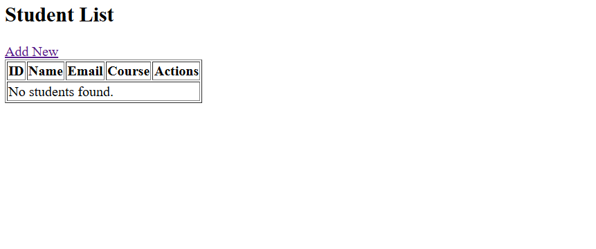
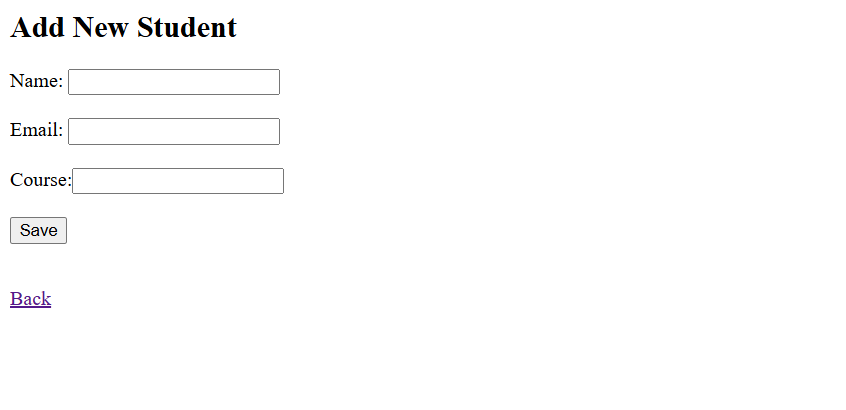
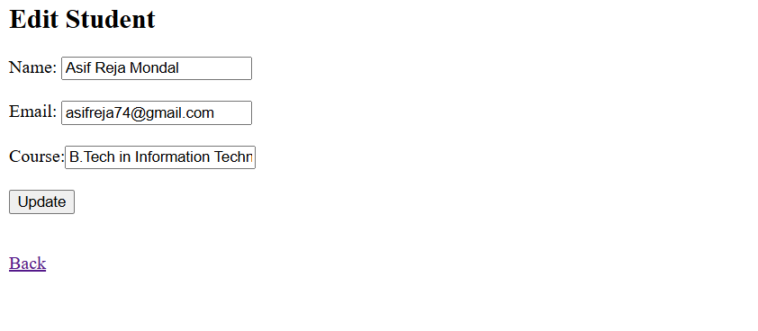
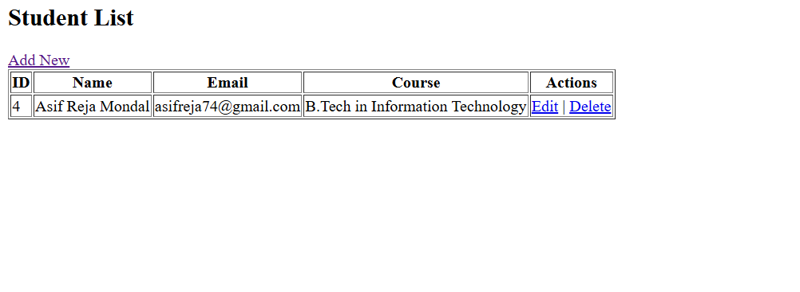

# 🎓 Student Management System

A full-featured Java Web Application built using **Servlets**, **JSP**, and **JDBC**, allowing users to perform CRUD (Create, Read, Update, Delete) operations on student records in a MySQL database.

---

## 🚀 Features

✅ View all students  
✅ Add new student  
✅ Edit existing student  
✅ Delete student record  
✅ Follows MVC architecture (Servlet → DAO → JSP)

---

## 🧰 Technologies Used

- **Java** (Servlet API)
- **JSP** (Java Server Pages)
- **JDBC** (Java Database Connectivity)
- **Apache Tomcat** (Servlet Container)
- **MySQL** (Database)
- **HTML/CSS** (Frontend)
- **Eclipse / IntelliJ IDEA** (Development)

---

## 📁 Project Structure

```
student-management-servlet-app/
├── src/
│   └── main/java/com/asif/servlet/
│       ├── Student.java
│       ├── StudentDao.java
│       ├── ListStudentServlet.java
│       ├── InsertStudentServlet.java
│       ├── EditStudentServlet.java
│       └── DeleteStudentServlet.java
├── WebContent/
│   ├── index.jsp
│   ├── add-student.jsp
│   ├── edit-student.jsp
│   └── WEB-INF/
│       └── web.xml
├── lib/
│   └── mysql-connector-java-X.X.X.jar
└── README.md
```

---

## ⚙️ Setup Instructions

### 📦 1. Clone or Download the Project

```bash
git clone https://github.com/as1fx/student-management-servlet-app.git
```

Or download as ZIP and extract.

---

### 💾 2. Set Up MySQL Database

1. Start your MySQL server.
2. Open your SQL client or terminal and run:

```sql
CREATE DATABASE studentdb;

USE studentdb;

CREATE TABLE students (
  id INT PRIMARY KEY AUTO_INCREMENT,
  name VARCHAR(100),
  email VARCHAR(100),
  course VARCHAR(100)
);
```

---

### 🔌 3. Configure MySQL Connection

Edit your `StudentDao.java` file:

```java
private String jdbcURL = "jdbc:mysql://localhost:3306/studentdb";
private String jdbcUsername = "root";     // change if needed
private String jdbcPassword = "root";     // change if needed
```

---

### 🧩 4. Add MySQL Connector JAR

Download [MySQL Connector/J](https://dev.mysql.com/downloads/connector/j/)  
Add the JAR file to your project:

- In Eclipse:  
  `Right-click Project → Build Path → Configure Build Path → Libraries → Add External JARs → Select mysql-connector-java.jar`

- In IntelliJ:  
  `File → Project Structure → Libraries → + → Java → Add JAR`

Also copy it into `lib/` folder if deploying as WAR.

---

### 🧱 5. Configure Apache Tomcat

1. Install [Apache Tomcat 9+](https://tomcat.apache.org/download-90.cgi)
2. In Eclipse/IntelliJ:
   - Add Tomcat as Server Runtime
   - Deploy this project on Tomcat
   - Run the project using `Run on Server`

---

## 🌐 Run the Application

Once deployed, open your browser and visit:

```
http://localhost:8080/student-management-servlet-app/
```

You should see the **Student List** page.

---

## 🛠 Troubleshooting

- ❗ *ClassNotFoundException for MySQL Driver*:  
  → Make sure `mysql-connector-java.jar` is added to both **classpath** and **/lib/**

- ❗ *404 Error on index.jsp*:  
  → Ensure `web.xml` has correct `<welcome-file>` or your servlet is mapped to `/list`

- ❗ *Port already in use*:  
  → Change Tomcat port from 8080 to something else in `server.xml`

---

## 📸 Screenshots

### 🔹 Student List Page
            

### 🔹 Add Student Page


### 🔹 Edit Student Page


### 🔹 Student List Page


---

## 📜 License

This project is for educational purposes. Use freely for learning and enhancement.

---

## ✍️ Author

**Asif**  
📫 [GitHub](https://github.com/as1fx)
